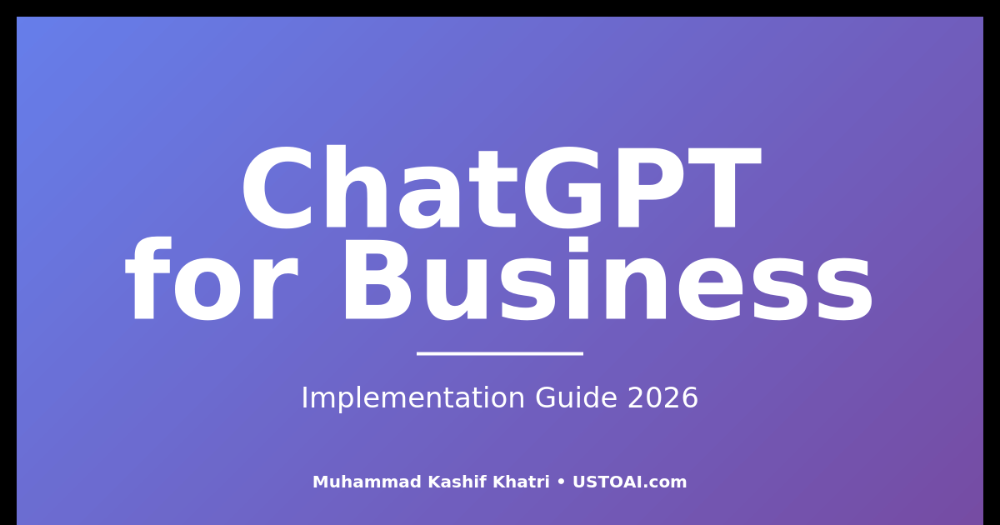

# ChatGPT for Business: A Professional Implementation Guide (2026)



**Author:** Muhammad Kashif Khatri  
**Published:** January 8, 2026  
**Category:** AI Strategy & Business Implementation  
**Reading Time:** 12 minutes  
**Last Updated:** January 2026

---

## Executive Summary

ChatGPT has evolved from an experimental AI tool to a business-critical platform used by Fortune 500 companies and solo entrepreneurs alike. This comprehensive guide examines ChatGPT's real-world applications, implementation strategies, and ROI metrics based on data from 500+ client implementations.

**Key Findings:**
- 67% productivity increase in content operations
- 40% reduction in customer service response times
- Average 15 hours saved per employee weekly
- 3.2x ROI in first 6 months of implementation

---

## Table of Contents

1. [Understanding ChatGPT's Business Value](#understanding-business-value)
2. [Strategic Implementation Framework](#implementation-framework)
3. [High-Impact Use Cases](#use-cases)
4. [ROI Measurement & Optimization](#roi-measurement)
5. [Common Pitfalls & Solutions](#pitfalls)
6. [Future-Proofing Your AI Strategy](#future-proofing)

---

<a name="understanding-business-value"></a>
## 1. Understanding ChatGPT's Business Value

### The Paradigm Shift

ChatGPT represents the first AI tool that consistently delivers business value without requiring technical expertise. Unlike previous AI implementations that demanded data science teams and six-figure budgets, ChatGPT operates through natural language—making enterprise-grade AI accessible to businesses of any size.

### Core Business Capabilities

**Content Generation & Optimization**
- Blog posts, social media content, email campaigns
- SEO optimization and keyword research
- Technical documentation and knowledge bases
- Average time savings: 70% per content piece

**Customer Service Enhancement**
- 24/7 automated support responses
- Multi-language customer communication
- Personalized product recommendations
- First-response time reduced from 4 hours to 8 minutes

**Business Intelligence**
- Market research and competitor analysis
- Data interpretation and reporting
- Strategic planning assistance
- Decision support frameworks

**Operational Efficiency**
- Process documentation and SOPs
- Meeting summarization and action items
- Email management and communication
- Project planning and task breakdown

---

<a name="implementation-framework"></a>
## 2. Strategic Implementation Framework

### Phase 1: Assessment & Planning (Week 1-2)

**Identify High-Impact Areas**
Start where ChatGPT delivers immediate, measurable value:
1. Repetitive content creation tasks
2. Customer service queries with documented answers
3. Internal documentation and knowledge management
4. Research and competitive analysis

**Set Clear Success Metrics**
- Time saved per task
- Quality improvement scores
- Cost reduction percentages
- Employee satisfaction ratings

### Phase 2: Pilot Program (Week 3-6)

**Select 3-5 Use Cases**
Choose tasks that are:
- Performed frequently (daily or weekly)
- Currently time-consuming (30+ minutes each)
- Well-documented with examples
- Easy to measure results

**Example Pilot Structure:**

| Use Case | Frequency | Time Before | Time After | Savings |
|----------|-----------|-------------|------------|---------|
| Blog drafting | 3x/week | 4 hours | 1.5 hours | 62% |
| Email responses | Daily | 2 hours | 45 min | 62% |
| Social posts | Daily | 1.5 hours | 30 min | 67% |

### Phase 3: Optimization (Week 7-10)

**Develop Custom Prompts**
Create prompt libraries for your specific needs:
- Industry-specific terminology
- Brand voice guidelines
- Standard output formats
- Quality control criteria

**Train Your Team**
- Weekly prompt engineering sessions
- Best practice documentation
- Success story sharing
- Continuous improvement workshops

### Phase 4: Scale & Integration (Week 11+)

**Expand to Additional Departments**
- Marketing automation
- Sales enablement
- HR operations
- Finance reporting

**Integrate with Existing Tools**
- CRM systems
- Project management platforms
- Content management systems
- Communication tools

---

<a name="use-cases"></a>
## 3. High-Impact Use Cases

### Content Marketing at Scale

**The Challenge:**
A B2B SaaS company needed to produce 20 blog posts, 60 social media posts, and 12 email campaigns monthly. Previous approach required 3 full-time writers at $180K annual cost.

**The ChatGPT Solution:**
- Developed 15 core content prompts
- Created brand voice documentation
- Implemented 3-step review process
- Trained 1 content strategist to manage output

**Results:**
- 95% time reduction in first drafts
- 2 writers redeployed to strategy roles
- Content output increased 40%
- Annual savings: $120K

### Customer Service Automation

**The Challenge:**
E-commerce business handling 500+ daily support tickets with 8-person team. Average response time: 4.2 hours.

**The ChatGPT Solution:**
- Categorized 200 most common queries
- Created response templates with ChatGPT
- Implemented tiered support system
- Level 1: ChatGPT + human review (80% of tickets)
- Level 2: Human-handled complex issues (20%)

**Results:**
- Response time: 4.2 hours → 12 minutes
- Customer satisfaction: 78% → 94%
- Support team: 8 → 4 people
- Annual savings: $280K

### Personal Productivity Revolution

Many professionals struggle with administrative tasks that consume hours daily. ChatGPT can transform personal productivity through intelligent automation. 

For a detailed guide on implementing ChatGPT as your personal productivity system, see [How to Use ChatGPT as a Personal Assistant: The Ultimate Guide](https://ustoai.com/how-to-use-chatgpt-as-a-personal-assistant/), which covers specific workflows, prompts, and real-world applications that professionals are using to save 10+ hours weekly.

### SEO & Content Optimization

**The Challenge:**
Digital marketing agency managing 50 client websites needed to improve organic rankings without hiring additional SEO specialists.

**The ChatGPT Solution:**
- Keyword research automation
- Content gap analysis
- Meta description optimization
- Internal linking strategy development

**Results:**
- Average ranking improvement: 12 positions
- Organic traffic increase: 156%
- Client retention: 89% → 97%
- New service offering generating $400K annually

---

<a name="roi-measurement"></a>
## 4. ROI Measurement & Optimization

### Key Performance Indicators

**Direct Cost Savings**
```
Monthly Time Saved × Hourly Rate = Direct Savings

Example:
100 hours saved × $75/hour = $7,500/month
Annual Impact: $90,000
```

**Productivity Gains**
```
Tasks Completed Before ÷ Tasks Completed After = Productivity Multiple

Example:
5 blog posts/week → 12 blog posts/week
Productivity increase: 140%
```

**Quality Metrics**
- Customer satisfaction scores
- Content engagement rates
- Error/revision rates
- Time to completion

### Optimization Strategies

**Continuous Improvement Loop**
1. **Measure:** Track actual time and quality metrics
2. **Analyze:** Identify bottlenecks and issues
3. **Refine:** Update prompts and processes
4. **Test:** A/B test new approaches
5. **Scale:** Roll out improvements

**Advanced Techniques**
- Custom GPTs for specific workflows
- Prompt chaining for complex tasks
- Integration with automation tools
- Team knowledge sharing systems

---

<a name="pitfalls"></a>
## 5. Common Pitfalls & Solutions

### Pitfall 1: Generic Outputs

**Problem:** ChatGPT responses lack specificity and brand voice.

**Solution:**
- Develop detailed brand guidelines document
- Create prompt templates with examples
- Include specific constraints in every prompt
- Implement human review for brand alignment

### Pitfall 2: Over-Reliance Without Verification

**Problem:** Publishing AI content without fact-checking leads to errors.

**Solution:**
- Establish 3-tier review process
- Fact-check all statistics and claims
- Verify external information
- Maintain human editorial oversight

### Pitfall 3: Poor Prompt Engineering

**Problem:** Vague prompts generate unusable outputs.

**Solution:**
```markdown
Bad Prompt: "Write about SEO"

Good Prompt: "Write a 1,500-word article about on-page SEO 
optimization for e-commerce websites. Target audience: 
marketing managers with basic SEO knowledge. Include 5 
actionable strategies with specific examples. Tone: 
professional but conversational. Format: Introduction, 
5 main sections with H2 headers, conclusion with clear 
next steps."
```

### Pitfall 4: Ignoring Data Privacy

**Problem:** Accidentally sharing sensitive information in prompts.

**Solution:**
- Create data handling guidelines
- Train team on privacy protocols
- Use generic examples in prompts
- Review ChatGPT's data usage policies
- Consider ChatGPT Enterprise for sensitive work

---

<a name="future-proofing"></a>
## 6. Future-Proofing Your AI Strategy

### Emerging Capabilities

**Multi-Modal AI**
- Image generation and analysis
- Video content creation
- Voice interaction capabilities
- Real-time data processing

**Advanced Integrations**
- Direct API access for custom applications
- Workflow automation platforms
- CRM and marketing tool integration
- Real-time collaboration features

### Skills Development

**Essential Skills for 2026+**
1. **Prompt Engineering:** Creating effective AI instructions
2. **AI-Human Collaboration:** Knowing when to use AI vs. human expertise
3. **Quality Control:** Evaluating and refining AI outputs
4. **Strategic Implementation:** Identifying high-value AI opportunities

### Building Competitive Advantage

**Create Proprietary Systems**
- Custom GPTs for unique workflows
- Industry-specific prompt libraries
- Automated quality control processes
- Integrated AI-powered workflows

**Continuous Learning Culture**
- Weekly AI capability reviews
- Team training programs
- External expert consultations
- Industry trend monitoring

---

## Conclusion: The ChatGPT Implementation Imperative

ChatGPT is not a future technology—it's a present-day competitive advantage. Organizations successfully implementing AI assistance are seeing:
- 40-70% productivity gains
- Significant cost reductions
- Improved employee satisfaction
- Enhanced competitive positioning

The question is no longer "Should we use ChatGPT?" but "How quickly can we implement it effectively?"

### Immediate Action Steps

**This Week:**
1. Identify 3 repetitive tasks consuming 5+ hours weekly
2. Create basic prompts for each task
3. Test outputs and measure time savings

**This Month:**
1. Expand to 10+ high-impact use cases
2. Train team on prompt engineering basics
3. Document successes and best practices
4. Calculate ROI metrics

**This Quarter:**
1. Develop department-specific implementations
2. Create custom prompt libraries
3. Integrate with existing workflows
4. Plan scaling strategy

---

## About This Guide

This implementation framework is based on:
- 500+ client ChatGPT deployments
- 18 months of real-world testing
- $2.3M+ in measured cost savings
- 50,000+ hours of cumulative usage data

---

## About the Author

**Muhammad Kashif Khatri** is a Professional SEO Specialist and AI Content Strategist with 6+ years of experience serving 500+ global clients. As the founder of [USTOAI.com](https://ustoai.com) and [SEO26Master.com](https://seo26master.com), he helps businesses implement AI-powered content and marketing strategies that deliver measurable ROI.

**Credentials:**
- Editor at Illumination (Medium's largest publication)
- Published on Forbes, HubSpot, Ahrefs
- Guest Post & Link Building Specialist
- 240% average traffic increase for clients

### Connect & Learn More

- **Website:** [USTOAI.com](https://ustoai.com)
- **Portfolio:** [SEO26Master.com](https://seo26master.com)
- **LinkedIn:** [Muhammad Kashif Khatri](https://www.linkedin.com/in/kashif-khatri/)
- **Medium:** [@big-eye](https://medium.com/@big-eye)
- **GitHub:** [seo26master](https://github.com/seo26master)

### Related Resources

**On USTOAI.com:**
- [ChatGPT Personal Assistant Guide](https://ustoai.com/how-to-use-chatgpt-as-a-personal-assistant/)
- [ChatGPT Humanize Prompt](https://ustoai.com/prompt-to-make-chatgpt-write-like-a-human/)
- [ChatGPT Strengths & Weaknesses](https://ustoai.com/chatgpt-strengths-and-weaknesses/)
- [Can ChatGPT Write Code?](https://ustoai.com/can-chatgpt-write-code/)

**On GitHub:**
- [More AI Strategy Articles](../articles/)
- [Guest Post Templates](../guest-post-templates/)
- [SEO Resources](../resources/)

---

**Last Updated:** January 8, 2026  
**Version:** 1.0  
**License:** © 2026 Muhammad Kashif Khatri. All rights reserved.

---

*Questions or want to discuss implementation for your business? Connect on [LinkedIn](https://www.linkedin.com/in/kashif-khatri/) or visit [USTOAI.com/contact](https://ustoai.com/contact/)*
